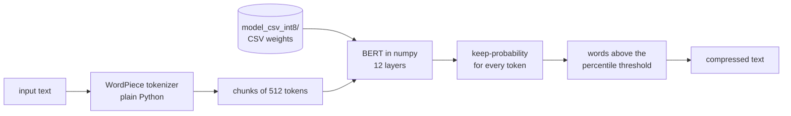

# csv-lingua

Prompt compression ([LLMLingua-2](https://github.com/microsoft/LLMLingua)) where the model is **only CSV files** and every step is **plain Python + numpy**: the WordPiece tokenizer, BERT's math and the compression rules are all written out, with nothing hidden inside an ML library.

Feed it a long text, get a shorter one that keeps the important words, so a prompt costs fewer tokens.

```
John: So, um, I've been thinking about the project, you know, and I believe we need to,
uh, make some changes. I mean, we want the project to succeed, right?

  ->  John :, ' been thinking about project, believe we need to, make changes.,
      want project to succeed, right?
```

Model: [`microsoft/llmlingua-2-bert-base-multilingual-cased-meetingbank`](https://huggingface.co/microsoft/llmlingua-2-bert-base-multilingual-cased-meetingbank), converted to 8-bit CSV (`model_csv_int8/`, 0.59 GB, included in this repository).



## Quick start

Needs Python 3.10+ and numpy, nothing else.

```bash
pip install -r requirements.txt
python compress.py examples/meeting.txt -o short.txt     # or: python -m csvlingua examples/meeting.txt
```

Checked on Python 3.10 (numpy 2.2) and Python 3.14 (numpy 2.4).

From Python:

```python
from csvlingua import compress_text

short = compress_text(long_text)                 # keeps about 60% of the words
short = compress_text(long_text, rate=0.3)       # keeps about 30%: shorter, rougher
```

The first call loads the model (about 4 seconds); after that each call is fast, because the model stays in memory.

What the rate does to one sentence (real output, model-card example):

| rate | result |
|---|---|
| 0.9 | John : So, um, I ' ve been thinking about the project, know, I believe we need to, make some changes. … |
| 0.6 | John :, ' been thinking about project, believe we need to, make changes., want project to succeed, right? … |
| 0.4 | John, thinking about project, need, make changes., want project succeed,?, consider revising timeline. |
| 0.2 | , project changes., project succeed?, timeline. |

Useful options:

| | |
|---|---|
| `--rate 0.3` | how much to keep (0.6 is the model card's setting) |
| `--lang zh-hant` | force the Chinese rules (`auto` decides by itself) |
| `--trace out.csv` | write every token's keep-probability and decision |
| `--model full` | use the full-precision model, if you built it |
| `--no-protect-code` | also compress code blocks (they are kept by default) |

## Mixed Chinese, English and code

`examples/mixed.txt` is a meeting note with all three. By default (`lang="auto"`):

- **Chinese**: 。，！？、：；are protected, 。！？ also end chunks, no spaces appear between Chinese characters, and punctuation left side by side after compression is tidied (`方便。，抱怨` becomes `方便。抱怨`).
- **English**: exactly Microsoft's settings.
- **Code**: ```` ``` ```` blocks and `` `inline code` `` are copied through untouched, because compressing them would break them.

~~~~
Amy：對，我上週用我們的 meeting notes 測試過，大概可以減少 40% 的 tokens。
```python
short = compress_text(f.read(), rate=0.6)
```

  ->  Amy：週用 meeting notes 測試，減少 40% 的 tokens。
      ```python
      short = compress_text(f.read(), rate=0.6)
      ```
~~~~

`lang="default"` turns all of this off and follows Microsoft's implementation exactly.

## How it works

1. **Protect.** Characters that must survive (`\n . ! ? ,`) are marked; `\n` is swapped for the added token `[NEW0]`. Code blocks are set aside.
2. **Tokenize.** Hugging Face's BERT tokenizer, rebuilt in plain Python: clean the text, split on spaces and punctuation, then greedy longest-match WordPiece.
3. **Chunk.** Up to 510 tokens, cut after the last `.` or newline, wrapped in `[CLS] … [SEP]`.
4. **BERT** (`bert_forward`): `h = LayerNorm(E_word + E_pos + E_type)`, then 12 × (`a = LayerNorm(h + W_o·Attention(h))`, `h = LayerNorm(a + W_2·GELU(W_1·a))`), then `p_keep = softmax(W_c·h)[:, 1]`.
5. **Words** (`merge_tokens_to_word`): a word's probability is the mean over its tokens; protected punctuation gets 1.0.
6. **Threshold** (`keep_threshold`): per chunk, the `int(100·(1−rate)+1)`-th percentile of the word probabilities, each word counted once per seven characters (`estimate_token_count`, standing in for GPT-3.5's token count); words above it are kept.
7. **Join** (`words_to_text`) the kept words back into text.

Everything is in [`csvlingua.py`](csvlingua.py), in that order. Steps 4 and 5–7 are separate calls (`run_model`, `render`), so you can run the model once and then try several rates instantly.

[`examples/walkthrough.md`](examples/walkthrough.md) shows all seven steps for one sentence with the real numbers: tokens and ids, the embedding row read from the CSV, the hidden states, every keep-probability, the word probabilities and the threshold. Run it on your own text with:

```bash
python tools/walkthrough.py "your sentence here"
```

## What is where

| file | what it is |
|---|---|
| [`csvlingua.py`](csvlingua.py) | everything: tokenizer, CSV reading, the math, BERT, compression, `compress_text` |
| [`compress.py`](compress.py) | the command line |
| [`convert.py`](convert.py) | Microsoft's `model.safetensors` → `model_csv/` (the only file that reads the binary) |
| [`quantize.py`](quantize.py) | `model_csv/` → `model_csv_int8/` |
| [`model_csv_int8/`](model_csv_int8) | the shipped model: config, vocabulary, manifest, weights |
| [`examples/`](examples) | input texts (English, Chinese, mixed, interview), compressed output, traces, measurements, walkthrough |
| [`tests/`](tests) | unit tests plus `golden/`: what Microsoft's code produced for the same inputs |
| [`tools/`](tools) | dev only: `reference_check.py`, `measure.py`, `walkthrough.py` |

## The CSV model

`model_csv_int8/` contains `config.csv`, `vocab.csv` (all 119,647 tokens), `manifest.csv` and `weights/*.csv`. One CSV row is one matrix row. In an 8-bit file each row starts with its scale, followed by integers in [−127, 127]; the weight is `scale · integer`:

```
0.001104970079,-27,7,-23,8,-29,17,15,-5,17,17,28,0,-25,-9,-22,-40,20,42,-23,...
```

`vocab.csv` is just as plain:

```
id,token,special
101,[CLS],1
31178,Hello,0
119547,[NEW0],1
```

Biases, LayerNorm parameters and the classifier stay as 7-decimal numbers. The files are read by a small parser in `csvlingua.py` that turns whole blocks of text into numbers with array operations, which is several times faster than `np.loadtxt` and gives exactly the same values.

## Measured results

All numbers come from a real run of `python tools/measure.py` on an AMD Ryzen 5 5600GT (6 cores / 12 threads), Python 3.14, numpy 2.4, and are stored in [`examples/results.csv`](examples/results.csv).

| | |
|---|---|
| 8-bit model | **0.591 GB**, 223 files, largest 14.4 MB |
| Full-precision model (optional, not shipped) | 1.869 GB |
| Load for one document | **3.8 s** (only the embedding rows the text needs) |
| One 512-token chunk through BERT | **0.97 s** (2.49 s in the first version) |
| Whole run: 7 kB meeting → 906 of 1534 words | **7.5 s**, 821 MB RAM |
| Tokenizer | 3.6 M characters/s |
| CSV parser | 30 MB/s on one thread, 86 MB/s on all cores |
| Long document: 104 kB, 50 chunks | 3.8 s load + 46 s BERT, about 2 k characters/s |

Accuracy against Microsoft's official implementation (llmlingua 0.2.2 with PyTorch), over 7,268 tokens of English and Chinese:

| | |
|---|---|
| Keep/drop decision, 8-bit model | **96.0–99.8 %** of words identical |
| … when given the reference's GPT-3.5 token counts | **98.9–100 %** |
| 8-bit vs full-precision model | 99.1–100 % of words identical |
| Full-precision CSV vs PyTorch | max \|Δ keep-probability\| **3.3×10⁻⁵** |

Where the remaining differences come from:

1. The reference weights each word by its GPT-3.5 (tiktoken) token count when it picks the threshold. tiktoken is not a dependency here, so `estimate_token_count` stands in for it with one token per seven characters. That alone changes 85 of 7,721 words — counting every word once instead would change 239. The rule was chosen on the example texts and checked on `examples/interview.txt`, which was not used to pick it.
2. 8-bit rounding moves probabilities that sit right at the threshold.

Speed-ups were checked to be **bit-identical**: the keep-probabilities of 19 chunks, and the compressed text for 8 texts × 2 languages × 4 rates, are unchanged from the first, slow implementation.

One caveat about "identical": numpy's BLAS adds up matrix products in an order that depends on how many threads it uses, so the last bits of a keep-probability can move if you run with a different thread count (`OPENBLAS_NUM_THREADS`). That is below the differences against the reference reported above, and it never changed a keep/drop decision in these tests, but it is why chunks are not processed in parallel here.

## Rebuilding

```bash
python convert.py    # download Microsoft's model.safetensors, write model_csv/ (1.87 GB, 7 decimals)
python quantize.py   # model_csv/ -> model_csv_int8/ (0.59 GB)
python -m unittest   # 44 tests; those needing model_csv/ skip if it is absent
python tools/measure.py
```

`tools/reference_check.py` produced the golden data in `tests/golden/` by running Microsoft's own code (torch + transformers + llmlingua, see `tools/requirements-ref.txt`). Runtime code never imports it; the tests compare against the stored results.

## Limits

- CPU only, and far slower than PyTorch: this is built to be read, not to be fast.
- Characters missing from the vocabulary become `[UNK]` and disappear, exactly as in the reference (1 of 326 distinct characters in the Chinese example).
- The model was fine-tuned on English meeting transcripts, so Chinese results are weaker than English.
- Options that need tiktoken (`target_token`) are not implemented.

## Credits and licenses

- Code: MIT (`LICENSE`).
- The CSV models are a converted form of Microsoft's model, Apache-2.0 (`NOTICE`, `LICENSE-MODEL.txt`).
- Algorithm: LLMLingua-2, Pan et al. 2024, [arXiv:2403.12968](https://arxiv.org/abs/2403.12968).
