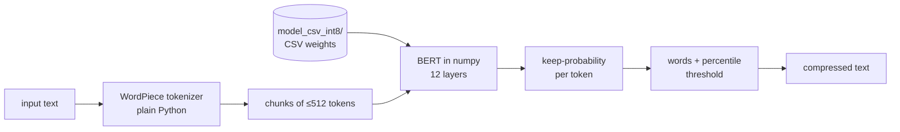

# csv-lingua

[LLMLingua-2](https://github.com/microsoft/LLMLingua) prompt compression with the model stored **only as CSV files** and every step written in **plain Python + numpy**: a WordPiece tokenizer, BERT's math and the compression rules, with nothing hidden inside ML libraries.

Model: [`microsoft/llmlingua-2-bert-base-multilingual-cased-meetingbank`](https://huggingface.co/microsoft/llmlingua-2-bert-base-multilingual-cased-meetingbank), shipped here as an 8-bit CSV model (`model_csv_int8/`, 0.59 GB).



## Quick start

Requirements: Python 3.10+ and numpy.

```bash
pip install -r requirements.txt
```

Compress a text file:

```bash
python compress.py examples/meeting.txt -o meeting.short.txt --rate 0.6
python compress.py examples/meeting.zh-hant.txt --lang zh-hant
```

Compress a string from Python:

```python
from csvlingua import compress_text

short = compress_text(long_text, rate=0.6)             # keep about 60% of the words
short = compress_text(chinese_text, lang="zh-hant")    # Traditional Chinese punctuation rules
```

The first call loads the model (about 13 s one file at a time). Inside an `if __name__ == "__main__":` block you can pass `workers=None` to read the CSVs on all CPU cores (about 3 s). Later calls reuse the model.

Options: `--rate` is the share of words to keep, `--trace file.csv` writes every token's keep-probability and decision, and `--model full` uses the full-precision model if you built it (see below).

## How it works

1. **Force tokens.** Characters that must survive (`\n . ! ? ,`) are protected; `\n` is replaced by the added token `[NEW0]`.
2. **Tokenizer.** Hugging Face's BERT tokenizer rebuilt in plain Python: clean the text, split on spaces and punctuation, then greedy longest-match WordPiece.
3. **Chunks.** Up to 510 tokens each, cut after the last `.` or newline, then `[CLS] … [SEP]`.
4. **BERT (numpy).** `h = LayerNorm(E_word + E_pos + E_type)`, then 12 times `a = LayerNorm(h + W_o·Attention(h))` and `h = LayerNorm(a + W_2·GELU(W_1·a))`, then `p_keep = softmax(W_c·h)[:, 1]`.
5. **Words.** A word's probability is the mean over its tokens; protected punctuation gets 1.0.
6. **Threshold.** Per chunk, the `int(100·(1−rate)+1)`-th percentile of the word probabilities; words above it are kept.
7. **Join** the kept words back into text.

All of it lives in [`csvlingua.py`](csvlingua.py), top to bottom.

## The CSV model

`model_csv_int8/` holds `config.csv`, `vocab.csv` (all 119,647 tokens), `manifest.csv` and `weights/*.csv`. One CSV row is one matrix row. In an 8-bit file each row is `scale, q1, q2, …` and the weights are `scale · q`:

```
0.001104970079,-27,7,-23,8,-29,17,15,-5,17,17,28,0,-25,-9,…
```

Biases, LayerNorm and the classifier are stored as plain decimals.

## Measured results

Measured on an AMD Ryzen 5 5600GT (12 threads) with numpy 2.4 and Python 3.14.

| | |
|---|---|
| 8-bit CSV model size | 0.591 GB, 223 files, largest 14.4 MB |
| Full-precision CSV model (not shipped) | 1.869 GB, 7 decimals |
| Load time, 8-bit model | 3.1 s (all cores), 12.8 s (one file at a time) |
| One 512-token chunk through BERT | 1.10 s |
| 8-bit vs full precision: same keep/drop label | 98.0–100 % of words (English and Chinese, rates 0.3–0.8) |
| 8-bit vs Microsoft's llmlingua: same label | 95.9–99.0 % of words |
| Full precision vs Microsoft's PyTorch model | max \|Δ keep-probability\| 3.3×10⁻⁵ |

Why the labels are not 100 % identical to llmlingua:

- The reference weights each word by its GPT-3.5 token count (tiktoken) when picking the threshold. tiktoken is not used here, so each word counts once. With the reference's own token counts, the 8-bit model agrees on 98.9–100 % of the words.
- 8-bit rounding changes a few probabilities that sit close to a threshold.

## Traditional Chinese (`--lang zh-hant`)

This mode adds `。，！？、：；` to the protected punctuation, and `。！？` also end chunks. It removes the spaces the English rules would put between Chinese characters. When compression leaves punctuation side by side (`。，`), only the strongest mark stays, and a mark at the start of a line is dropped.

The model was fine-tuned on English meeting transcripts, so Chinese compression quality is lower than English.

## Rebuilding the models

```bash
python convert.py    # downloads Microsoft's model.safetensors, writes model_csv/ (1.87 GB)
python quantize.py   # model_csv/ -> model_csv_int8/
python -m unittest   # tests; full-precision parity tests run only if model_csv/ exists
```

`tools/reference_check.py` produced the golden data in `tests/golden/` by running Microsoft's official code (it needs torch, transformers and llmlingua; see `tools/requirements-ref.txt`). Runtime code never imports it.

## Limits

- CPU only, and much slower than PyTorch.
- Characters missing from the vocabulary become `[UNK]` and are dropped, as in the reference.
- `target_token` and the other llmlingua options that need tiktoken are not implemented.

## Credits and licenses

- Code: MIT (see `LICENSE`).
- The CSV models are a converted form of Microsoft's model, which is Apache-2.0 (see `NOTICE` and `LICENSE-MODEL.txt`).
- The algorithm comes from LLMLingua-2 (Pan et al., 2024, arXiv:2403.12968).
